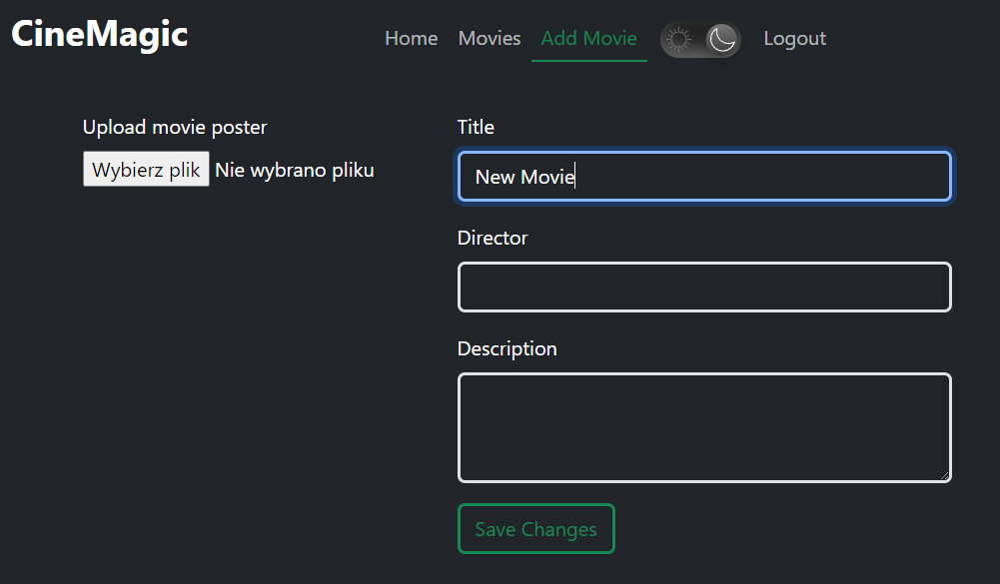
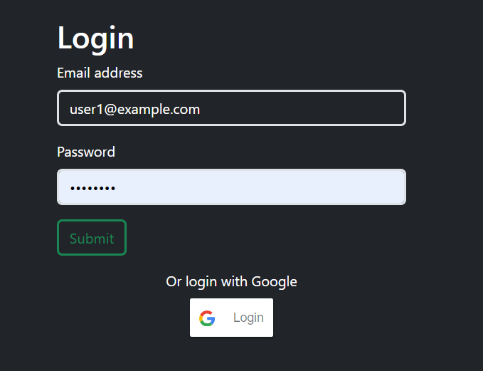

# CineMagic
CineMagic is a movie rating and review sharing web application, built using .NET 7 and React. This project offers various features including authentication via JWT, Google login, user roles, and more.

## Technologies

- **Backend**: .NET 7
- **Frontend**: React
- **Database**: Microsoft SQL

## Features

1. **Authentication**:
   - JWT-based authentication
   - Google login integration

2. **User Roles**:
   - Admin and User roles
   - Admin can add movies with posters
   - Users can rate and comment on movies

3. **Light-Dark Mode**:
   - Toggle between light and dark themes for better user experience

**HOW TO RUN**

1. Download or clone repository.

2. To use image features, you need to create a FREE Cloudinary account. Get CloudName, Api key, and API secret and paste them in `docker-compose.yml`.  
   Remember to paste your_cloudinary_cloud_name in the frontend service as well.

3. Run `docker-compose up`

4. Web application will be available on [http://localhost:3006](http://localhost:3006)

You can use automatically created accounts:  
- User account:  
  - email: user1@example.com  
  - password: password  
- Admin account:  
  - email: admin@example.com  
  - password: password

Database will be empty. Feel free to add your movies using the admin account.

